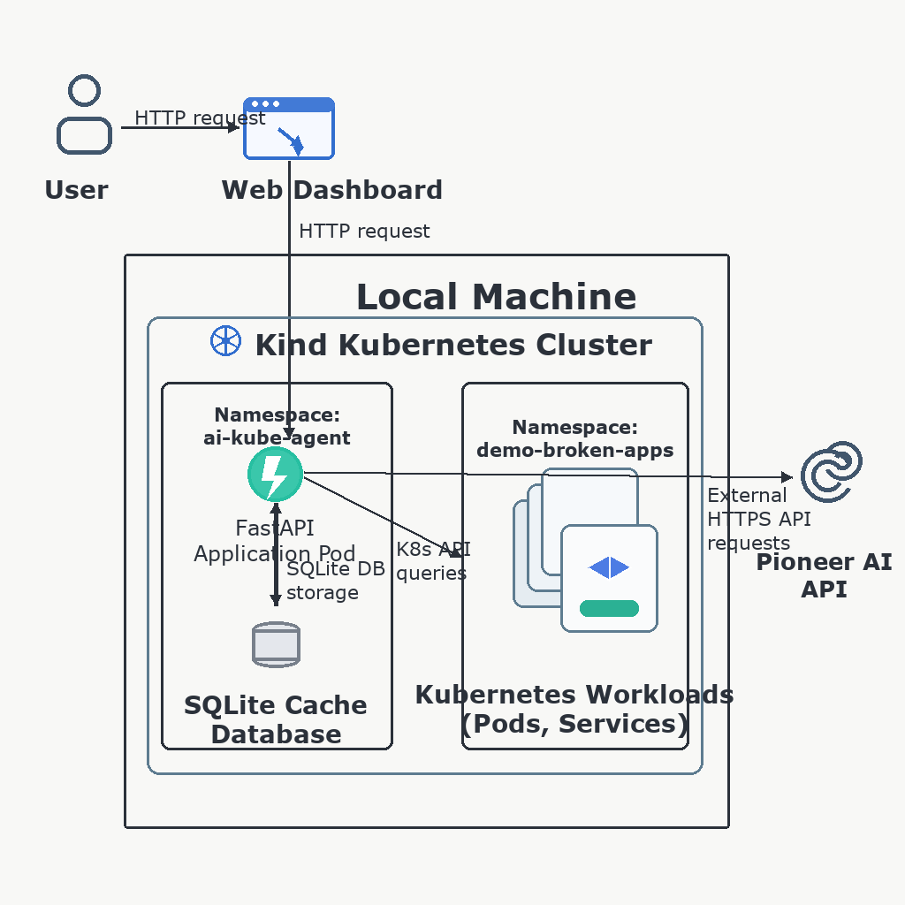
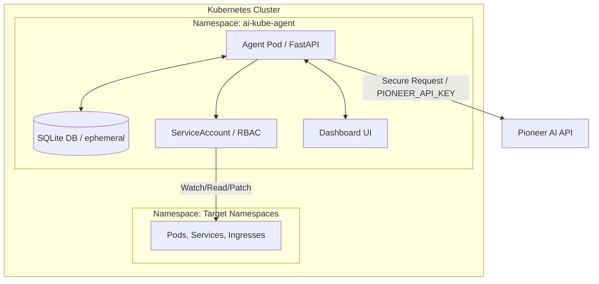
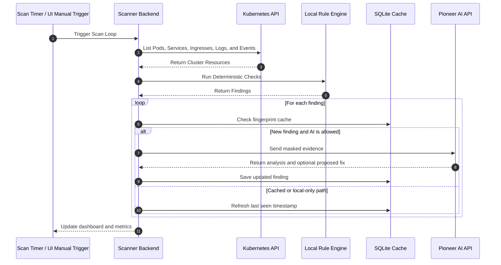

# AI Kubernetes Troubleshooting Agent

Author: Hakan Bayraktar

This project is a local Kubernetes troubleshooting lab. It scans cluster resources, applies deterministic rules for common failure modes, and can optionally request deeper analysis from the Pioneer AI API. Any remediation remains user-approved.

## Overview

Troubleshooting workloads in Kubernetes often requires checking pod state, events, logs, service selectors, endpoints, and ingress wiring together. This agent runs inside the cluster, collects that evidence, and presents findings in a dashboard so operators can inspect issues and optionally generate guided remediation plans.

### Core Features

- Local Kubernetes monitoring for pod failures such as `CrashLoopBackOff`, `ImagePullBackOff`, `OOMKilled`, `CreateContainerConfigError`, and `Pending`
- Deterministic rule engine for fast analysis before any external AI request is attempted
- Optional Pioneer AI integration for complex or unknown failures
- Human-in-the-loop remediation flow with explicit approval before any patch is applied
- Demo scenarios that intentionally create broken workloads for local testing
- Secret masking for logs, prompts, and stored configuration

## Architecture

The project is designed to run on a local **Kind (Kubernetes in Docker)** cluster.





### Namespaces and Components

```text
Kubernetes Cluster
├── ai-kube-agent namespace
│   ├── ai-kube-agent Deployment (FastAPI backend + Jinja2/JS dashboard)
│   ├── Service (ClusterIP)
│   ├── ConfigMap (application settings)
│   ├── Secret (Pioneer AI API key)
│   ├── ServiceAccount
│   ├── ClusterRole
│   └── ClusterRoleBinding
└── demo-broken-apps namespace
    ├── crashloop-demo
    ├── imagepull-demo
    ├── oomkilled-demo
    ├── bad-config-demo
    ├── service-no-endpoints-demo
    ├── ingress-bad-backend-demo
    ├── network-policy-demo
    └── ai-analysis-demo
```

## How It Works

The agent periodically scans pods, services, endpoints, and ingresses. For unhealthy resources it collects status, restart counts, termination reasons, recent logs, events, and traffic relationships. The local rule engine classifies each finding, decides whether AI analysis is needed, and avoids duplicate external requests by using a fingerprint cache.



## Local Rule Engine

The rule engine performs deterministic checks to reduce unnecessary AI requests:

- `CrashLoopBackOff`: checks restart counts, back-off events, and log hints such as `connection refused`, `timeout`, `permission denied`, and `panic`
- `ImagePullBackOff` and `ErrImagePull`: checks image naming, tags, and `imagePullSecrets`
- `OOMKilled`: checks container resource limits and last termination reason
- `Pending` and `FailedScheduling`: checks node pressure, taint or toleration mismatch, and PVC binding issues
- `CreateContainerConfigError`: detects missing ConfigMap or Secret references
- `ServiceNoEndpoints`: checks service selector and pod label matching
- `IngressBadBackend`: checks whether the referenced backend service and port exist

## Pioneer AI Integration

When AI analysis is enabled, the agent sends masked evidence to `https://api.pioneer.ai/v1/chat/completions`. The default model value in this repository is the neutral placeholder `pioneer-fast`. If your endpoint expects a different model identifier, set `PIONEER_MODEL` explicitly.

Example response shape:

```json
{
  "summary": "Short issue summary",
  "probable_root_cause": "Most likely root cause",
  "severity": "Critical/High/Medium/Low",
  "confidence": "0.0 - 1.0",
  "recommended_actions": ["Suggested actions"],
  "commands_to_verify": ["Verification commands"],
  "prevention": ["Prevention ideas"],
  "junior_friendly_explanation": "Simple explanation",
  "action_plan": ["Step-by-step plan"],
  "proposed_fix": {
    "patch_target": "deployment/v1",
    "patch_data": {}
  }
}
```

### Security and Cost Controls

- Sensitive values such as `Authorization: Bearer ...`, `DATABASE_URL`, `password=...`, and `token=...` are masked before external requests
- Identical findings are cached to avoid repeated AI calls
- `AI_RATE_LIMIT_PER_SCAN` limits AI requests per scan
- `AI_MIN_SEVERITY` prevents lower-severity findings from being sent externally

## Prerequisites

| Tool | Minimum Version | Install |
|------|-----------------|---------|
| Docker / Docker Desktop | 24.0+ | [docker.com](https://www.docker.com/) |
| Kind | 0.23+ | `brew install kind` or [kind.sigs.k8s.io](https://kind.sigs.k8s.io/) |
| kubectl | 1.29+ | `brew install kubectl` or [kubernetes.io](https://kubernetes.io/docs/tasks/tools/) |
| Git | 2.0+ | [git-scm.com](https://git-scm.com/) |
| Browser | Modern | Chrome, Firefox, Safari, or equivalent |

## Local Setup

### Automated Setup

The fastest path is the provided script:

```bash
chmod +x scripts/local_test.sh
./scripts/local_test.sh
```

If you want AI analysis, export your key first:

```bash
export PIONEER_API_KEY="your-api-key"
export PIONEER_MODEL="your-provider-model-id"
```

The script will:

1. Validate local prerequisites
2. Create or reuse a Kind cluster named `ai-kube-agent-local`
3. Build the Docker image
4. Load the image into Kind
5. Apply Kubernetes manifests
6. Deploy demo workloads
7. Start port forwarding on `http://127.0.0.1:18080`
8. Trigger a scan and print a short validation summary

Use `./scripts/local_test.sh --reset` to recreate the cluster from scratch.

### Manual Setup

#### 1. Create the Kind cluster

```bash
kind create cluster --name ai-kube-agent-local
```

#### 2. Build the image

```bash
docker build -t ai-kube-agent:local .
```

#### 3. Load the image into Kind

```bash
kind load docker-image ai-kube-agent:local --name ai-kube-agent-local
```

#### 4. Create the namespace and API secret

```bash
kubectl apply -f k8s/namespace.yaml

kubectl create secret generic pioneer-ai-secret \
  --from-literal=PIONEER_API_KEY="${PIONEER_API_KEY:-}" \
  -n ai-kube-agent \
  --dry-run=client -o yaml | kubectl apply -f -
```

#### 5. Deploy the agent

```bash
kubectl apply -k k8s/
```

#### 6. Deploy the demo workloads

```bash
kubectl apply -f demo/namespace.yaml
kubectl apply -f demo/
```

#### 7. Open the dashboard

```bash
kubectl port-forward svc/ai-kube-agent 18080:80 -n ai-kube-agent
```

Open `http://127.0.0.1:18080`.

## Dashboard

The dashboard shows:

- Active findings with severity, namespace, resource, and root-cause summary
- Solved findings history
- Rule-based evidence and AI analysis for a selected finding
- Interactive remediation plans for supported failure types
- Runtime settings such as scan interval, AI severity threshold, rate limits, and log line limits

The demo modal can create intentionally broken workloads in `demo-broken-apps` so you can verify the full troubleshooting flow locally.

## Remediation Flow

1. The scanner detects a finding.
2. The user opens the finding in the dashboard.
3. The user requests an AI-generated action plan.
4. The user reviews and confirms the generated patch.
5. The backend applies the patch only after explicit approval.
6. The finding moves to `resolved` after a later scan confirms recovery.

### Supported Remediation Patterns

| Problem Type | Typical Action |
|--------------|----------------|
| `CrashLoopBackOff` | Inject or correct required environment variables and restart the workload |
| `OOMKilled` | Patch memory requests and limits |
| `ImagePullBackOff` | Update the image name or tag |
| `CreateContainerConfigError` | Create the missing ConfigMap and restart the rollout |

### RBAC Boundaries

The service account is intentionally limited. Write actions are restricted to selected resources in the demo namespace. Sensitive namespaces such as `kube-system` are outside the remediation scope.

## Runtime Settings

The dashboard exposes live settings:

- `Scan Interval (seconds)`: periodic scan cadence
- `AI Min Severity Filter`: minimum severity required for external AI analysis
- `AI Rate Limit (per scan)`: max AI calls per scan cycle
- `Log Line Limit`: max pod log lines attached to analysis
- `Enable Pioneer AI Analysis`: enables external AI analysis and guided remediation
- `AI Remediation Mode`: choose between suggestion-only and executable fixes
- `AI Remediation Namespaces`: restrict write access to selected namespaces

## API Endpoints

| Method | Endpoint | Description |
|--------|----------|-------------|
| `GET` | `/` | Dashboard HTML |
| `GET` | `/healthz` | Liveness probe |
| `GET` | `/readyz` | Readiness probe |
| `GET` | `/api/findings` | Active findings |
| `GET` | `/api/findings/resolved` | Recently resolved findings |
| `GET` | `/api/findings/{id}` | Finding details |
| `POST` | `/api/scan` | Trigger a manual scan |
| `GET` | `/api/summary` | Cluster summary and trends |
| `GET` | `/api/config` | Public-safe runtime config |
| `POST` | `/api/config` | Update runtime config |
| `GET` | `/api/findings/{id}/ai-plan` | Generate an interactive remediation plan |
| `POST` | `/api/findings/{id}/ai-execute` | Apply an approved remediation plan |
| `POST` | `/api/demo/reset` | Reset demo workloads and trigger a scan |
| `GET` | `/api/metrics` | Prometheus metrics |

### Prometheus Metrics

- `kube_ai_agent_findings_total`
- `kube_ai_agent_ai_requests_total`
- `kube_ai_agent_scan_duration_seconds`
- `kube_ai_agent_last_scan_timestamp`
- `kube_ai_agent_ai_errors_total`

## Extending the Project

### Add Another AI Provider

- Extend [app/ai_client.py](app/ai_client.py) with another client implementation
- Add the required environment variables in [app/config.py](app/config.py)
- Point `PIONEER_ENDPOINT` and `PIONEER_MODEL` at the target service

### Add More Deterministic Rules

- Expand the analyzers in [app/rule_engine.py](app/rule_engine.py)
- Add fixtures or regression tests in [tests/test_rule_engine.py](tests/test_rule_engine.py)

## Running Tests

Run the unit test container:

```bash
docker build --target test -t ai-kube-agent:test .
docker run --rm ai-kube-agent:test sh -c "ruff check app tests && pytest -q -o cache_dir=/tmp/.pytest_cache"
```

## Cleanup

Delete the local Kind cluster:

```bash
kind delete cluster --name ai-kube-agent-local
```
