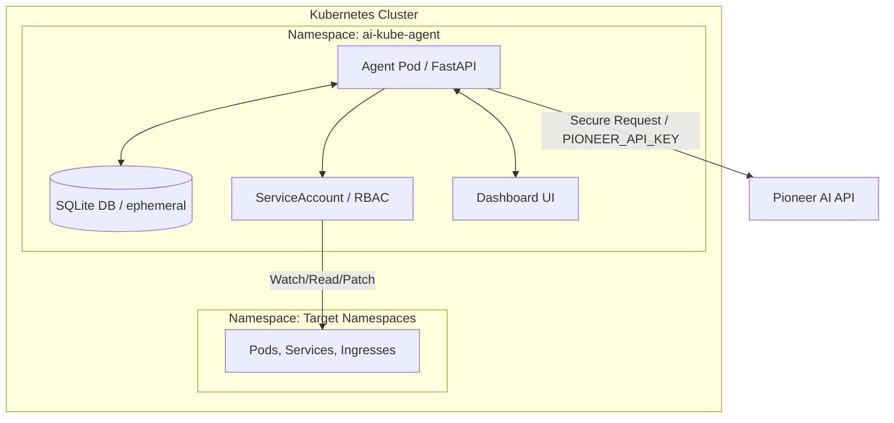
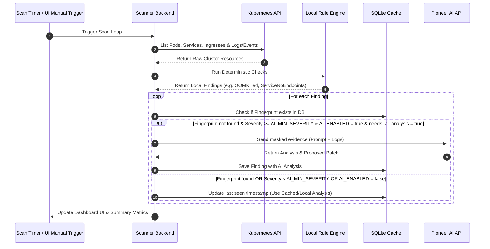
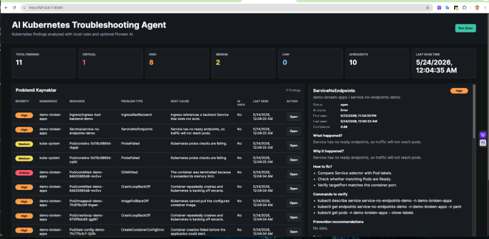
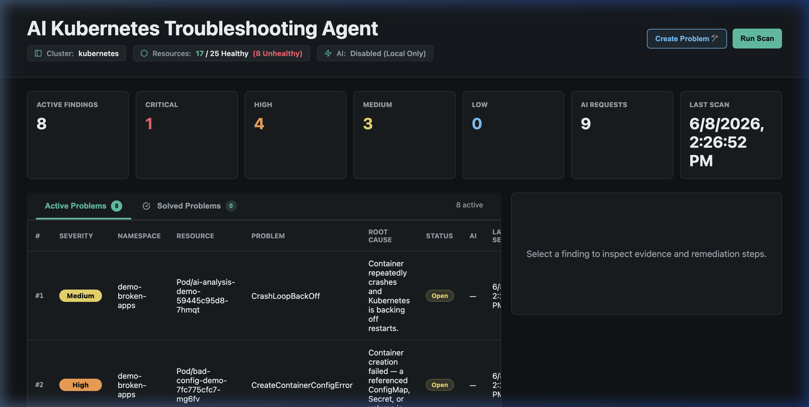
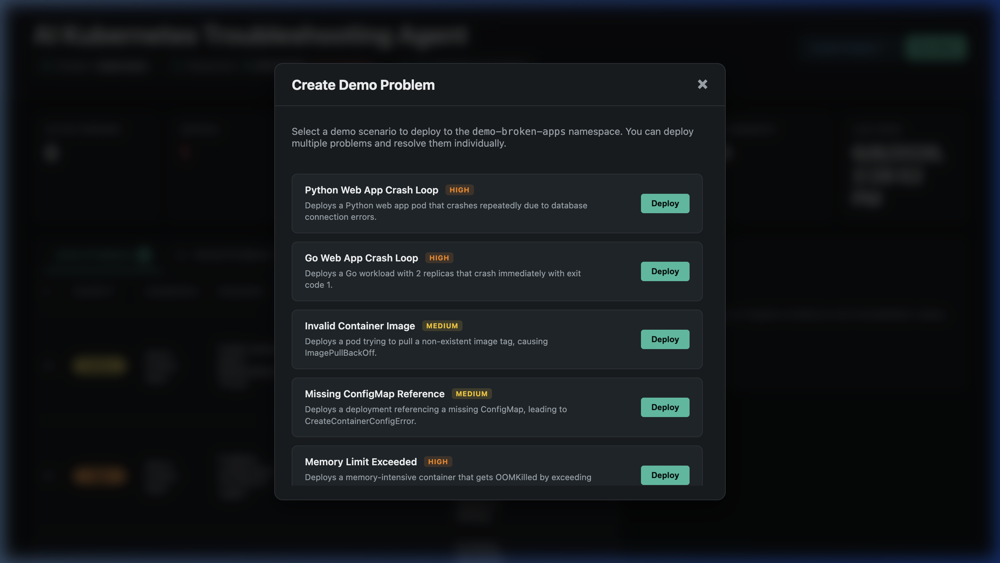
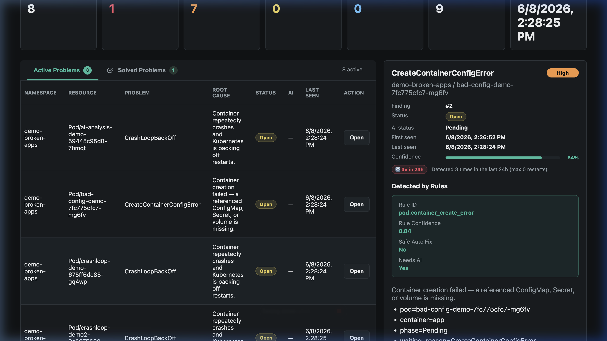

# AI Kubernetes Troubleshooting Agent

Kubernetes cluster'ındaki hataları yerel deterministik kurallar (local rules) ve Pioneer AI desteğiyle analiz eden, kullanıcı onaylı etkileşimli hata giderme (self-healing) yeteneğine sahip local Kubernetes demo uygulaması.

Bu proje, platform mühendisliği ve AI entegrasyonu konularına ilgi duyan geliştiriciler ile DevOps mühendisleri için yerel bir öğrenme, test ve prototip geliştirme laboratuvarı sunmaktadır.

---

## 📖 Projenin Amacı ve Özellikleri

Kubernetes cluster'larında çalışan uygulamaların hatalarını ayıklamak (troubleshooting) genellikle karmaşık ve zaman alıcıdır. Pod hataları, Kubernetes eventleri, `kubectl describe` status bilgileri, container logları, Service, Endpoint ve Ingress ilişkileri gibi birçok farklı verinin bir arada incelenmesini gerektirir. 

Bu agent, Kubernetes cluster'ında bir Pod olarak çalışır, cluster durumunu izler ve junior DevOps mühendislerinin hata ayıklama sürelerini azaltmayı ve deterministik yerel çözümleri AI analiz yetenekleriyle birleştirmeyi hedefler.

### Temel Özellikler
- **Yerel K8s İzleme**: Pod hataları (`CrashLoopBackOff`, `ImagePullBackOff`, `OOMKilled`, `CreateContainerConfigError`, `Pending` vb.), events, loglar, Service, Endpoint ve Ingress durumlarını izler.
- **Local Rule Engine (Yerel Kural Motoru)**: CrashLoopBackOff, ImagePullBackOff, OOMKilled gibi yaygın hataları yerel kurallarla hızlıca analiz eder. Eğer problem biliniyorsa AI API çağrısı yapmadan hızlı çözüm önerir, böylece AI maliyetini ve gecikmesini minimize eder.
- **Pioneer AI Entegrasyonu**: Yerel kuralların çözemediği karmaşık veya bilinmeyen hataları Pioneer AI API (`claude-haiku-4-5`) aracılığıyla güvenli ve maskelenmiş olarak analiz eder.
- **Kullanıcı Onaylı İyileştirme (Human-in-the-Loop)**: Agent hiçbir zaman otomatik patch uygulamaz. Arayüzden hatayı seçip "Solve with AI" butonuna bastığınızda AI parametrik bir eylem planı oluşturur. Siz parametreleri onayladıktan sonra değişiklikler cluster'a uygulanır.
- **Demo Hata Simülasyonu**: "Create Problem" modalı veya "Reset Demo" butonu yardımıyla cluster üzerinde anında kasıtlı hatalar (bozuk podlar, eksik configmapler vb.) üretebilir ve agent'ın bunları nasıl çözdüğünü adım adım test edebilirsiniz.
- **Güvenli API Key Saklama**: API anahtarları asla kod veya manifest dosyalarında saklanmaz. Doğrudan Kubernetes Secret olarak etcd üzerinde tutulur. AI'ye gönderilen veriler (loglar, env verileri) hassas bilgilerden arındırılır (masking).

---

## 🛠️ Mimari

Proje, yerel makinenizde koşan bir **Kind (Kubernetes in Docker)** cluster üzerinde çalışır.

### Genel Sistem Mimarisi
Aşağıdaki diyagramda, yerel makinedeki bilesenlerin ve veri akışının genel yapısı gösterilmektedir:




### Namespace Bileşenleri
```text
Kubernetes Cluster
├── ai-kube-agent namespace
│   ├── ai-kube-agent Deployment (FastAPI backend + Jinja2/JS dashboard)
│   ├── Service (ClusterIP)
│   ├── ConfigMap (Uygulama ayarları)
│   ├── Secret (Pioneer AI API anahtarı)
│   ├── ServiceAccount
│   ├── ClusterRole
│   └── ClusterRoleBinding
└── demo-broken-apps namespace (Hata simülasyonları)
    ├── crashloop-demo
    ├── imagepull-demo
    ├── oomkilled-demo
    ├── bad-config-demo
    ├── service-no-endpoints-demo
    ├── ingress-bad-backend-demo
    ├── network-policy-demo
    └── ai-analysis-demo
```

---

## 🔄 Agent Nasıl Çalışır?

Agent varsayılan olarak belirlenen aralıklarla tespiti otomatik gerçekleştirir. Pod, Service, Endpoint ve Ingress kaynaklarını listeler. Problemli kaynaklar için event, status, restart count, termination reason, log tail ve trafik ilişkilerini toplar. Sonra local rule engine çalışır. Rule engine her finding için problem tipi, confidence, güvenli auto-fix var mı ve AI analizi gerekip gerekmediğini üretir. Aynı problem daha önce analiz edildiyse fingerprint üzerinden güncellenir ve gereksiz AI çağrısı yapılmaz.



---

## ⚙️ Yerel Kural Motoru (Local Rule Engine)

Yerel kural motoru deterministik kontroller gerçekleştirerek gereksiz AI çağrılarının önüne geçer:

- **CrashLoopBackOff**: restart count, back-off eventleri ve loglarda `connection refused`, `timeout`, `permission denied`, `panic` gibi ipuçlarını arar.
- **ImagePullBackOff ve ErrImagePull**: imaj adı, etiket hataları ve `imagePullSecrets` eksikliklerini analiz eder.
- **OOMKilled**: Konteynerin limit durumunu ve podun son sonlanma nedenini kontrol ederek hafıza yetersizliğini yakalar.
- **Pending ve FailedScheduling**: Node yetersizliği, taint/toleration uyuşmazlığı veya PVC bound hatalarını kontrol eder.
- **CreateContainerConfigError**: Eksik ConfigMap veya Secret referanslarını işaret eder.
- **ServiceNoEndpoints**: Service selector ile Pod label eşleşmelerini kontrol eder.
- **IngressBadBackend**: Ingress üzerinde belirtilen backend servisinin ve portunun varlığını sorgular.

---

## 🤖 Pioneer AI API Entegrasyonu ve Güvenlik

### İstek ve Yanıt Yapısı
AI analizi tetiklendiğinde agent, Pioneer AI API (`https://api.pioneer.ai/v1/chat/completions`) adresine güvenli bir istek gönderir.
Pioneer model olarak `claude-haiku-4-5` kullanır. Dönen JSON formatındaki yanıt şu alanları içerir:
```json
{
  "summary": "Hatanın kısa özeti",
  "probable_root_cause": "Kök neden tahmini",
  "severity": "Critical/High/Medium/Low",
  "confidence": "Güven oranı (0.0 - 1.0)",
  "recommended_actions": ["Önerilen adımlar"],
  "commands_to_verify": ["Doğrulama komutları"],
  "prevention": ["Gelecekte önleme tavsiyeleri"],
  "junior_friendly_explanation": "Junior dostu basit açıklama",
  "action_plan": ["Uygulanabilir adım planı"],
  "proposed_fix": {
    "patch_target": "deployment/v1",
    "patch_data": {}
  }
}
```

### API Key Güvenliği ve Maskeleme
Uygulama, hassas verilerin dışarıya sızmasını engellemek için gelişmiş log ve prompt maskeleme katmanına sahiptir. `Authorization: Bearer ...`, `DATABASE_URL`, `password=...`, `token=...` gibi kritik örüntüler otomatik olarak `******` ile maskelenir.

### Maliyet Kontrolü
- Otomatik cache sistemi sayesinde aynı hatayla tekrar karşılaşıldığında AI çağrısı yapılmaz.
- `AI_RATE_LIMIT_PER_SCAN` (varsayılan: 5) ile tek taramadaki maksimum istek sayısı sınırlandırılır.
- `AI_MIN_SEVERITY` (varsayılan: High) ile düşük seviyeli hataların AI'ye gitmesi engellenerek token tasarrufu sağlanır.

---

## 📋 Ön Koşullar

| Araç | Minimum Sürüm | Kurulum Linki |
|------|---------------|---------------|
| **Docker / Docker Desktop** | 24.0+ | [docker.com](https://www.docker.com/) |
| **Kind** | 0.23+ | `brew install kind` (macOS) veya [kind.sigs.k8s.io](https://kind.sigs.k8s.io/) |
| **kubectl** | 1.29+ | `brew install kubectl` veya [kubernetes.io](https://kubernetes.io/docs/tasks/tools/) |
| **Git** | 2.0+ | [git-scm.com](https://git-scm.com/) |
| **Tarayıcı** | Modern Tarayıcı | Google Chrome, Firefox, Safari vb. |

---

## 🚀 Kind ile Adım Adım Kurulum ve Çalıştırma

### A. Otomatik Kurulum (Önerilen Hızlı Yol)

1. Proje dizininde scripti çalıştırılabilir yapın:
   ```bash
   chmod +x scripts/local_test.sh
   ```
2. AI analizi yapmak istiyorsanız API anahtarınızı tanımlayın (yoksa local-only modda çalışır):
   ```bash
   export PIONEER_API_KEY="pioneer-api-keyiniz"
   ```
3. Kurulum scriptini çalıştırın:
   ```bash
   ./scripts/local_test.sh
   ```

---

### B. Manuel Kurulum Adımları

#### 1. Kind Cluster Oluşturma
```bash
kind create cluster --name ai-kube-agent-local
```

#### 2. Docker Imajını Derleme
```bash
docker build -t ai-kube-agent:local .
```

#### 3. Imajı Kind Cluster'ına Yükleme
```bash
kind load docker-image ai-kube-agent:local --name ai-kube-agent-local
```

#### 4. Namespace ve API Secret Tanımlama
```bash
kubectl apply -f k8s/namespace.yaml

kubectl create secret generic pioneer-ai-secret \
  --from-literal=PIONEER_API_KEY="${PIONEER_API_KEY:-}" \
  -n ai-kube-agent \
  --dry-run=client -o yaml | kubectl apply -f -
```

#### 5. Agent Bileşenlerini Deploy Etme
```bash
kubectl apply -k k8s/
```

#### 6. Demo Hatalı Uygulamaları Deploy Etme
```bash
kubectl apply -f demo/namespace.yaml
kubectl apply -f demo/
```

#### 7. Port-Forwarding ile Dashboard'u Açma
```bash
kubectl port-forward svc/ai-kube-agent 18080:80 -n ai-kube-agent
```
Dashboard'a erişim adresi: **http://127.0.0.1:18080**

---

## 💻 Dashboard ve Kullanım Rehberi

Arayüz, Kubernetes cluster'ınızdaki sorunları izlemek, AI/lokal kurallar ile analiz etmek ve sorunları doğrudan cluster üzerinde çözmek (self-healing) için tasarlanmıştır.

### Dashboard Arayüzü


### Detaylı Ekran Görüntüleri ve İşlevleri:

#### 1. Genel Durum ve Bulgular (Findings)
Cluster'daki tüm sorunlar durumlarına ve önem seviyelerine göre listelenir. "AI Status" rozeti AI'ın aktif/pasif durumunu gösterir. Satır sonundaki **"Open"** butonu ile detay paneline erişilir.


#### 2. Hata Simüle Etme (Create Problem Modalı)
Dashboard'un üstündeki "Create Problem" butonuna bastığınızda açılan modal yardımıyla kasıtlı olarak hata türleri seçip cluster üzerine anında deploy edebilirsiniz.


#### 3. Detay ve Çözüm Planı Paneli (Action Plan)
Bulgu seçildiğinde sağda açılan panel 3 bölümden oluşur:
- **Detected by Rules**: Yerel deterministik kural tespitleri.
- **AI Analysis**: Claude AI tarafından sağlanan derin kök neden analizi.
- **Action Plan / Çözüm Akışı**: "Solve with AI" yardımıyla parametrik hata düzeltme formu.


---

## ⚡ Kendi Kendini İyileştirme (AI Remediation)

Uygulamanın en güçlü özelliklerinden biri, kullanıcı kontrollü etkileşimli hata giderme akışıdır:

### Çalışma Akışı
1. **Tespit**: Tarama sonucunda bir bulgu (Finding) tespit edilir (Rule engine varsayılan olarak `proposed_fix=null` üretir).
2. **Talep**: Kullanıcı dashboard üzerinden hatayı seçer ve "Solve with AI" butonuna tıklar (AI aktif olmalıdır).
3. **Plan Üretimi**: Arka planda `GET /api/findings/{id}/ai-plan` çağrılır ve AI hata tipi için parametrik bir plan üretir:
   - **CrashLoopBackOff (Veritabanı bağlantısı vb.)**: `DATABASE_URL` env girişi
   - **OOMKilled**: Yeni `memory_limit` ve `memory_request` limit değerleri girişi
   - **ImagePullBackOff**: Düzeltilmiş doğru `image` adı ve etiketi girişi
   - **CreateContainerConfigError**: Eksik ConfigMap/Secret adı ve verileri
4. **Onay ve Patch**: Kullanıcı girdileri kontrol edip düzenler ve **Apply Fix** butonuna tıklar. `POST /api/findings/{id}/ai-execute` tetiklenerek cluster deployment nesnesine patch uygulanır.
5. **Çözüm**: Hata durumu önce `remediating` olur, yeni tarama podun ayağa kalktığını tespit ettiğinde `resolved` durumuna geçer.

### Desteklenen Düzeltme Tipleri
| Hata Tipi | AI / Agent Aksiyonu |
|-----------|--------------------|
| **CrashLoopBackOff (db bağlantısı)** | `DATABASE_URL` environment variable enjeksiyonu ve pod restart |
| **OOMKilled** | Deployment memory limits/requests patch işlemi |
| **ImagePullBackOff** | Container imajı ismi/etiketi güncellemesi |
| **CreateContainerConfigError** | Eksik olan ConfigMap oluşturulması ve rollout restart |

### RBAC Güvenlik Sınırları
Agent'ın ServiceAccount yetkisi yalnızca `demo-broken-apps` namespace'indeki `deployments`, `services`, `configmaps` ve `ingresses` kaynakları üzerinde `create`, `patch`, `update` yetkisine sahiptir. `kube-system` veya diğer hassas namespace bileşenlerine müdahale yetkisi tamamen engellenmiştir.

---

## ⚙️ Çalışma Zamanı Ayarları (Runtime Settings)

Dashboard'un en altında yer alan panel, agent'ın çalışma davranışlarını tarayıcı üzerinden canlı olarak değiştirmenizi ve API token tüketimini optimize etmenizi sağlar:
- **Scan Interval (seconds)**: Taramaların kaç saniyede bir yapılacağını ayarlar (varsayılan 10 dakikadır - 600 saniye).
- **AI Min Severity Filter**: Hangi önem derecesindeki hataların AI analizine gönderileceğini seçer. Gereksiz sistem uyarılarını engellemek için bu değeri `High` veya `Critical` yapabilirsiniz.
- **AI Rate Limit (per scan)**: Tek bir tarama işlemi sırasında yapılabilecek maksimum AI istek limitini belirler.
- **Log Line Limit**: Analiz için AI'ye gönderilecek maksimum pod log satırı sınırıdır (varsayılan: 150).
- **Enable Pioneer AI Analysis**: İşaretlendiğinde hem AI otomatik scan analizi hem de "Solve with AI" etkileşimli iyileştirme aktif olur. Devre dışı bırakıldığında agent **sıfır token** tüketimiyle yalnızca lokal kurallarla çalışır.

---

## 🔌 API Endpointleri ve Prometheus Metrikleri

### API Endpointleri
| Method | Endpoint | Açıklama |
|--------|----------|----------|
| `GET` | `/` | Dashboard HTML sayfası |
| `GET` | `/healthz` | Liveness check probe |
| `GET` | `/readyz` | Readiness check probe |
| `GET` | `/api/findings` | Tüm aktif findings listesi |
| `GET` | `/api/findings/resolved` | Son 15 dakikada çözülmüş findings arşivi |
| `GET` | `/api/findings/{id}` | Tek finding detayı |
| `POST` | `/api/scan` | Manuel scan tetikler |
| `GET` | `/api/summary` | Cluster sağlık özeti ve trendleri |
| `GET` | `/api/config` | Public-safe config bilgisi (secret içermez) |
| `POST` | `/api/config` | Runtime ayarları günceller |
| `GET` | `/api/findings/{id}/ai-plan` | AI interaktif iyileştirme planı getirir |
| `POST` | `/api/findings/{id}/ai-execute` | Onaylanan iyileştirme planını cluster'a uygular |
| `POST` | `/api/demo/reset` | Demo broken apps'leri siler ve anlık scan tetikler |
| `GET` | `/api/metrics` | Prometheus formatında metrics üretir |

### Prometheus Metrikleri
- `kube_ai_agent_findings_total`: Toplam aktif sorun sayısı.
- `kube_ai_agent_ai_requests_total`: Yapılan toplam AI analizi sayısı.
- `kube_ai_agent_scan_duration_seconds`: Son taramanın saniye bazında süresi.
- `kube_ai_agent_last_scan_timestamp`: Son başarılı taramanın zaman damgası.
- `kube_ai_agent_ai_errors_total`: Alınan toplam AI hatası sayısı.

---

## 🎨 Projeyi Genişletme (Extending the Project)

Bu proje modüler ve genişletilebilir bir mimariye sahiptir. Kendi geliştirme süreçleriniz için şu yolları izleyebilirsiniz:

### 1. Farklı AI Sağlayıcıları Ekleme
Farklı AI modellerini (OpenAI GPT, Anthropic Claude, Google Gemini veya yerel Ollama/Llama modelleri) entegre etmek için:
- [app/ai_client.py](file:///Users/hakan/devopsatolyesi/devops-ai-kube-agent/app/ai_client.py) dosyasındaki `PioneerAIClient` benzeri bir sınıf oluşturun.
- [app/config.py](file:///Users/hakan/devopsatolyesi/devops-ai-kube-agent/app/config.py) üzerinde gerekli yeni env tanımlamalarını yapın (örn: `OPENAI_API_KEY`).

### 2. Yeni Deterministik Kurallar Ekleme
Yerel kural motorunu zenginleştirmek ve yeni Kubernetes kaynaklarını (StatefulSet, DaemonSet, HPA vb.) analiz etmek için:
- [app/rule_engine.py](file:///Users/hakan/devopsatolyesi/devops-ai-kube-agent/app/rule_engine.py) dosyasında yer alan analiz metodlarını genişletin.

---

## 🧪 Birim Testleri Çalıştırma

Tüm testleri lokalinizde herhangi bir Python bağımlılığı kurmaya gerek duymadan Docker ortamında çalıştırabilirsiniz:
```bash
docker build --target test -t ai-kube-agent:test .
docker run --rm ai-kube-agent:test sh -c "ruff check app tests && pytest -q -o cache_dir=/tmp/.pytest_cache"
```

---

## 🧹 Temizlik

Oluşturduğunuz local Kind cluster'ını ve tüm kaynakları tek bir komutla silebilirsiniz:
```bash
kind delete cluster --name ai-kube-agent-local
```
