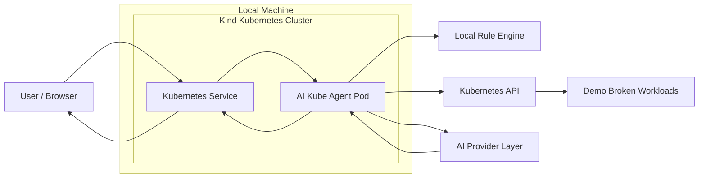
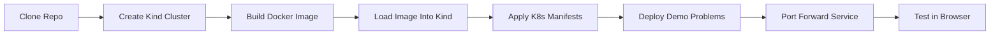
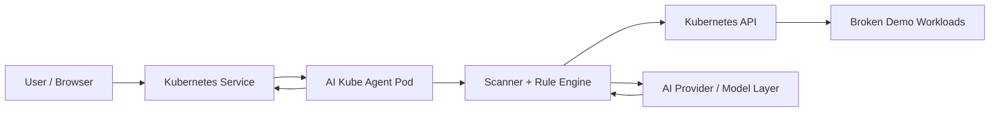

# Medium Makalesi: Kind Uzerinde AI Destekli Kubernetes Troubleshooting Lab

## 1. Baslik Onerileri

- Kind Uzerinde AI Destekli Kubernetes Troubleshooting Lab: DevOps ve Platform Engineer'lar Icin Uygulamali Demo
- Local Kubernetes Cluster'da AI Destekli Hata Analizi: Kind ile Uygulamali DevOps Lab
- DevOps Engineer'lar Icin AI + Kubernetes Projesi: Kind Uzerinde Troubleshooting Dashboard
- Platform Engineering Yolunda AI Destekli Kubernetes Sorun Analizi: Kind ile Local Lab

**Secilen baslik:**

# Kind Uzerinde AI Destekli Kubernetes Troubleshooting Lab: DevOps ve Platform Engineer'lar Icin Uygulamali Demo

## 2. Medium-Ready Tam Turkce Makale

Kubernetes bilmek artik tek basina yeterli degil. Ozellikle Platform Engineer, DevOps Engineer ve SRE rollerinde; bir uygulamanin nasil containerize edildigini, cluster uzerinde nasil deploy edildigini, servis olarak nasil aciga cikarildigini ve operasyonel sorunlarin nasil analiz edildigini anlamak giderek daha kritik hale geliyor.

Bu yazida, GitHub'daki `devops-ai-kube-agent` projesini kullanarak local ortamda bir **Kind Kubernetes cluster** uzerinde AI destekli bir troubleshooting dashboard'u ayaga kaldiracagiz. Amacimiz production mimarisi kurmak degil; Kind uzerinde calisan, gorunur, test edilebilir ve ogretici bir Kubernetes lab'i olusturmak.

Bu proje ozellikle su acilardan degerli:

- Kubernetes uzerinde calisan bir operasyonel araci uc uca goruyorsunuz.
- Dashboard, Service, Deployment, RBAC ve ConfigMap gibi temel nesneleri beraber kullaniyorsunuz.
- Demo bozuk workload'lar sayesinde gercek hata senaryolariyla calisiyorsunuz.
- AI katmaninin Kubernetes troubleshooting surecine nasil eklendigini pratik olarak goruyorsunuz.

Makalenin sonunda projeyi GitHub'dan klonlayip kendi bilgisayarinizda calistirabilecek, dashboard'a browser uzerinden baglanabilecek ve farkli hata senaryolarini test edebileceksiniz.

## Bu Proje Ne Ise Yariyor?

`AI Kubernetes Troubleshooting Agent`, Kubernetes cluster icindeki problemleri tarayan ve bunlari dashboard uzerinden gosteren bir uygulama. Uygulama pod, service, ingress, event ve log gibi kanitlari topluyor; once local rule engine ile analiz ediyor, gerekirse AI provider katmanindan ek yorum aliyor.

Pratikte su sekilde calisiyor:

1. Kullanici browser uzerinden dashboard'a girer.
2. Agent cluster'daki problemli kaynaklari tarar.
3. Local kurallar; `CrashLoopBackOff`, `ImagePullBackOff`, `OOMKilled`, `ServiceNoEndpoints` gibi sorunlari tespit eder.
4. AI etkinse ve belirli esikleri gecen finding'ler varsa, AI katmani ek analiz uretir.
5. Sonuclar dashboard'da goruntulenir.
6. Kullanici bu finding'leri inceleyerek sorunun kok nedenini anlamaya baslar.

Bu yonuyle proje, Kubernetes uzerinde AI destekli operasyonel analiz mantigini test etmek icin guzel bir baslangic noktasi sunuyor.

## Neden Kind Kullaniyoruz?

Kind, local bilgisayarda Docker container'lari uzerinde Kubernetes cluster calistirmayi saglar. Ozellikle demo, egitim ve lab senaryolari icin cok pratiktir.

Kind kullanmanin bu proje icin avantajlari:

- Cloud maliyeti olusturmaz.
- Dakikalar icinde local cluster kurabilirsiniz.
- Kubernetes manifestlerini rahatca test edebilirsiniz.
- DevOps ve Platform Engineer adaylari icin guclu bir sandbox ortami sunar.
- Demo bozuk uygulamalari guvenli sekilde local ortamda denemenizi saglar.

Kisacasi, bu proje icin Kind ideal cunku odagimiz cloud provisioning degil, **Kubernetes uzerinde uygulama ve troubleshooting akisini anlamak**.

## Mimari Genel Bakis

Asagidaki basit mimari, local bilgisayarda calisan Kind cluster icindeki ana bilesenleri gosteriyor:



Bu mimaride kullanici browser ile dashboard'a erisir. Trafik Kubernetes Service uzerinden agent pod'una gider. Agent, cluster kaynaklarini okuyarak problemli durumlari analiz eder. Gerekirse AI provider katmanina istek gonderir ve sonucu tekrar dashboard'a yansitir.

Repo'nun local lab akisinda kullanabileceginiz ikinci diyagram da kurulum surecini ozetler:



## Program Nasil Caliyor?

Bu projeyi bir chat uygulamasi gibi degil, bir **Kubernetes troubleshooting dashboard'u** gibi dusunmek gerekiyor.

Adim adim calisma mantigi su:

1. Agent belirli araliklarla veya manuel tetikleme ile scan baslatir.
2. Kubernetes API uzerinden pod, service, ingress, events ve log verilerini toplar.
3. Local rule engine deterministik kontroller yapar.
4. Basit ve iyi bilinen problemler lokal olarak etiketlenir.
5. Daha kompleks finding'ler icin AI analizi devreye alinabilir.
6. Tum sonuc dashboard'da severity, root cause ve aksiyon onerileriyle listelenir.

Bu tasarim neden onemli?

- Sadece "uygulama deploy etmek" degil, operasyonel gorunurluk kurmayi da ogreniyorsunuz.
- AI'nin dogrudan uygulama cevabi ureten bir katman degil, **operator'a yardimci analiz katmani** olarak nasil konumlandigini goruyorsunuz.
- Farkli provider'lar veya modeller ileride bu yapinin uzerine eklenebilir.

Bugun Pioneer AI endpoint'i kullaniliyor olabilir; yarin benzer yapiyla farkli provider entegrasyonlari da eklenebilir.

## Proje On Gereksinimleri

Kuruluma baslamadan once su araclara ihtiyaciniz var:

- Docker: Kind cluster node'larini container olarak calistirmak icin kullanilir.
- Kind: Local Kubernetes cluster olusturmak icin kullanilir.
- kubectl: Kubernetes kaynaklarini yonetmek ve dogrulamak icin kullanilir.
- Git: Projeyi GitHub'dan klonlamak icin kullanilir.
- Chrome veya modern bir browser: Dashboard'u test etmek icin gerekir.
- Temel terminal bilgisi: Komutlari calistirip ciktilari yorumlamak icin gerekir.

Repo icindeki `scripts/local_test.sh` bu sureci oldukca kolaylastiriyor. Yine de once manuel akisla mantigi kurmak faydali.

## GitHub Reposunu Klonlama

Projeyi local ortama almak icin:

```bash
git clone https://github.com/devopsatolyesi/devops-ai-kube-agent.git
cd devops-ai-kube-agent
```

Bu komutlarla projeyi bilgisayarimiza indiriyoruz ve calisma klasorune giriyoruz.

> GitHub reposunu makalenin sonunda tekrar paylasiyorum. Siz de projeyi klonlayip kendi bilgisayarinizda test edebilirsiniz.

## Kind Cluster Olusturma

Kind ile local cluster'i su komutla olusturabilirsiniz:

```bash
kind create cluster --name ai-kube-agent-local
```

Cluster baglantisini kontrol etmek icin:

```bash
kubectl cluster-info --context kind-ai-kube-agent-local
kubectl get nodes --context kind-ai-kube-agent-local
```

Bu adimda Docker uzerinde calisan local bir Kubernetes cluster olusturuyoruz.

## Docker Image Build Etme

Uygulama image'ini build etmek icin:

```bash
docker build -t ai-kube-agent:local .
```

Bu image daha sonra Kind cluster icine yuklenecek. Kind, local Docker image'larini dogrudan cluster node'larina otomatik gormez; ayrica yuklemek gerekir.

## Image'i Kind Icine Yukleme

Build edilen image'i Kind cluster'a yuklemek icin:

```bash
kind load docker-image ai-kube-agent:local --name ai-kube-agent-local
```

Bu adim, local Docker image'ini cluster icindeki node'lara tasir.

## Kubernetes Manifestlerini Deploy Etme

Repo icindeki Kubernetes manifestleri `k8s/` klasorunde bulunuyor. Namespace, RBAC, ConfigMap, Deployment, Service ve NetworkPolicy gibi bilesenleri deploy etmek icin:

```bash
kubectl --context kind-ai-kube-agent-local apply -f k8s/namespace.yaml
kubectl --context kind-ai-kube-agent-local apply -k k8s/
```

Kurulum sonrasi kontrol komutlari:

```bash
kubectl --context kind-ai-kube-agent-local get pods -n ai-kube-agent
kubectl --context kind-ai-kube-agent-local get svc -n ai-kube-agent
kubectl --context kind-ai-kube-agent-local get deployments -n ai-kube-agent
```

Bu adimla agent dashboard'unu ve arka plandaki uygulama bilesenlerini Kind cluster uzerine deploy ediyoruz.

## Demo Sorunlari Deploy Etme

Bu repo'nun guzel yani, yalnizca agent'i degil ayni zamanda test icin kasitli bozuk workload'lari da saglamasi. Demo namespace'ini ve ornek problem manifestlerini deploy etmek icin:

```bash
kubectl --context kind-ai-kube-agent-local apply -f demo/namespace.yaml
kubectl --context kind-ai-kube-agent-local apply -f demo/
```

Bu manifestler arasinda farkli problem tipleri bulunuyor:

- `crashloop-demo`
- `imagepull-demo`
- `oomkilled-demo`
- `bad-config-demo`
- `service-no-endpoints-demo`
- `ingress-bad-backend-demo`
- `network-policy-demo`
- `ai-analysis-demo`

Bu sayede dashboard bos kalmaz; gercek hata tipleri uzerinde deneme yapabilirsiniz.

## Uygulamaya Browser Uzerinden Erisme

Service tipimiz `ClusterIP`, bu nedenle local makineden erismek icin port-forward kullanacagiz:

```bash
kubectl --context kind-ai-kube-agent-local -n ai-kube-agent port-forward svc/ai-kube-agent 18080:80
```

Ardindan browser'da su adresi acin:

```text
http://127.0.0.1:18080
```

Bu komut local bilgisayarimizdaki `18080` portunu Kubernetes Service'e yonlendirir. Boylece dashboard'u browser uzerinden test edebiliriz.

## Otomatik Kurulum Secenegi

Eger tum bu adimlari tek tek yapmak istemiyorsaniz repo icindeki script isi oldukca hizlandiriyor:

```bash
chmod +x scripts/local_test.sh
./scripts/local_test.sh
```

Opsiyonel olarak AI analizi de test etmek isterseniz:

```bash
export PIONEER_API_KEY="sk-..."
./scripts/local_test.sh
```

Bu script sunlari otomatik yapiyor:

- Docker, Kind ve kubectl kontrolu
- Kind cluster olusturma
- Docker image build etme
- Image'i Kind'a yukleme
- `k8s/` manifestlerini deploy etme
- Demo bozuk uygulamalari deploy etme
- Port-forward baslatma
- Dashboard'u `http://127.0.0.1:18080` uzerinden acma

Yeni baslayanlar icin en rahat yol bu scripti kullanmak, ama manuel akis mantigi anlamak icin daha ogretici.

## Uygulama Kullanim Senaryosu

Dashboard acildiginda asagidaki senaryoyu test edebilirsiniz:

1. Browser'da dashboard'u acin.
2. Agent'in cluster'da tespit ettigi aktif finding'leri inceleyin.
3. Ornegin `CrashLoopBackOff` veya `ImagePullBackOff` gibi bir finding secin.
4. Root cause, severity ve onerilen aksiyonlari okuyun.
5. AI etkinse AI destekli yorumu da gorun.
6. `kubectl get pods -A` ve dashboard ciktisini birlikte yorumlayin.

Bu kullanim senaryosu size su konularda pratik kazandirir:

- Kubernetes hata tiplerini tanimak
- Dashboard ve cluster durumunu birlikte okumak
- Servis, pod, selector ve config iliskilerini anlamak
- AI destekli analiz katmaninin operasyonel degerini gormek

## DevOps / Platform Engineering Acisindan Bu Projenin Degeri

Bu repo'yu sadece bir demo UI olarak gormemek gerekir. Aslinda kucuk ama faydali bir platform engineering laboratuvari sunuyor.

Bu projede su yetenekleri pratik ediyorsunuz:

- Local Kubernetes cluster olusturma
- Kubernetes Deployment mantigi
- Kubernetes Service mantigi
- Port-forward ile local erisim
- RBAC ile kontrollu cluster erisimi
- Demo workload uzerinden troubleshooting
- Rule engine ve AI katmanini birlikte dusunme
- Dashboard + backend + K8s entegrasyonu kurma

Ozellikle junior ve mid-level muhendisler icin en degerli kisim su: Kubernetes sorunlarini yalnizca `kubectl get pods` seviyesinde degil, daha sistematik bir akisla ele almayi ogreniyorsunuz.

## Bu Proje Nasil Gelistirilebilir?

Bu local lab hali bile oldukca faydali; ancak daha da gelistirilebilir:

- Farkli AI provider entegrasyonlari eklenebilir.
- Provider secimi icin UI dropdown eklenebilir.
- Secret ve config yonetimi daha moduler hale getirilebilir.
- Helm chart destegi eklenebilir.
- Ingress tabanli lokal erisim opsiyonel hale getirilebilir.
- Prometheus + Grafana ile monitoring katmani eklenebilir.
- Loki veya ELK ile log merkezi hale getirilebilir.
- Authentication ve role-based dashboard erisimi eklenebilir.
- Daha gelismis remediation guardrail'leri tanimlanabilir.
- Multi-cluster veya namespace scoping daha net yonetilebilir.

Bu noktada onemli not su:

> Bu makaledeki kurulum local lab ve ogrenme odaklidir. Production hardening, cloud deployment ve CI/CD detaylari bu yazinin kapsam disindadir.

## Sonuc

Bu lab'de Kind uzerinde calisan AI destekli bir Kubernetes troubleshooting dashboard'unu ayaga kaldirdik. Docker image build ettik, Kubernetes manifestlerini deploy ettik, Service ve port-forward mantigiyla browser erisimi sagladik ve demo bozuk workload'lar uzerinden gercek troubleshooting senaryolari olusturduk.

En onemlisi, AI'nin Kubernetes uzerinde yalnizca "cevap ureten" bir katman degil; operasyonel analiz ve karar destegi sunan bir yardimci katman olarak nasil konumlanabilecegini gormus olduk.

Proje, local ortamda test edilebilir, kolay tekrar edilebilir ve gelistirmeye acik bir temel sunuyor. Eger Kubernetes, Platform Engineering veya AI destekli operasyonel tooling alanina ilgi duyuyorsaniz, bu repo guzel bir portfoy ve ogrenme calismasi olabilir.

GitHub Repository:

```text
https://github.com/devopsatolyesi/devops-ai-kube-agent.git
```

Projeyi klonlayin, kendi Kind cluster'inizde calistirin, farkli demo problemleri test edin ve isterseniz kendi AI provider entegrasyonlarinizi ekleyerek gelistirin.

## 3. Makale Icinde Kullanilacak Gorsel Onerileri

Makale icin su gorselleri kullanmanizi oneririm:

1. Kapak gorseli
   `AI + Kubernetes + Kind + Dashboard` temasinda sade bir kapak.
   Oneri baslik: `AI-Powered Kubernetes Troubleshooting on Kind`

2. Mimari diyagram
   Browser -> Service -> AI Kube Agent Pod -> Kubernetes API / AI Provider akisini gosteren Mermaid diyagram.

3. Kurulum akisi diyagrami
   `Clone Repo -> Create Kind Cluster -> Build Image -> Deploy -> Port Forward -> Open Dashboard`

4. Browser ekran goruntusu
   Dashboard'un ana ekrani.
   Repo'da mevcut gorsel: `docs/dashboard.png`

5. Mimari gorseli
   Repo'da mevcut gorsel: `docs/architecture.png`

6. Terminal cikti gorselleri
   `kubectl get pods -A`
   `kubectl get svc -n ai-kube-agent`
   `kind get clusters`

7. Problem akis gorseli
   `Demo broken workloads -> Scanner -> Rule Engine -> Optional AI Analysis -> Dashboard`

Not:
README'deki mevcut gorselleri aynen kullanabilirsiniz ama Medium icin daha sade, daha buyuk ve okunur versiyonlar tercih etmek daha iyi olur.

## 4. Mermaid Mimari Diyagrami



## 5. Kurulum ve Kullanim Komutlari

### Repo'yu klonlama

```bash
git clone https://github.com/devopsatolyesi/devops-ai-kube-agent.git
cd devops-ai-kube-agent
```

### Kind cluster olusturma

```bash
kind create cluster --name ai-kube-agent-local
kubectl cluster-info --context kind-ai-kube-agent-local
kubectl get nodes --context kind-ai-kube-agent-local
```

### Docker image build etme

```bash
docker build -t ai-kube-agent:local .
kind load docker-image ai-kube-agent:local --name ai-kube-agent-local
```

### Agent deploy etme

```bash
kubectl --context kind-ai-kube-agent-local apply -f k8s/namespace.yaml
kubectl --context kind-ai-kube-agent-local apply -k k8s/
kubectl --context kind-ai-kube-agent-local get pods -n ai-kube-agent
kubectl --context kind-ai-kube-agent-local get svc -n ai-kube-agent
```

### Demo workload deploy etme

```bash
kubectl --context kind-ai-kube-agent-local apply -f demo/namespace.yaml
kubectl --context kind-ai-kube-agent-local apply -f demo/
```

### Browser erisimi

```bash
kubectl --context kind-ai-kube-agent-local -n ai-kube-agent port-forward svc/ai-kube-agent 18080:80
```

Browser:

```text
http://127.0.0.1:18080
```

### Tek komutla otomatik local kurulum

```bash
chmod +x scripts/local_test.sh
./scripts/local_test.sh
```

AI ile test etmek icin:

```bash
export PIONEER_API_KEY="sk-..."
./scripts/local_test.sh
```

## 6. GitHub Linki Icin CTA Bolumu

Makale sonunda su cagrıyı kullanabilirsiniz:

> Projeyi kendi bilgisayarinizda test etmek isterseniz repoyu klonlayip Kind uzerinde dakikalar icinde ayaga kaldirabilirsiniz. Dashboard'u acin, demo bozuk workload'lari inceleyin ve isterseniz kendi AI provider entegrasyonlarinizi ekleyerek projeyi genisletin.

```text
GitHub Repository:
https://github.com/devopsatolyesi/devops-ai-kube-agent.git
```

## 7. LinkedIn'de Paylasmak Icin Kisa Turkce Post Onerisi

Bugun local ortamda `Kind` uzerinde calisan bir **AI destekli Kubernetes troubleshooting lab** denedim.

Bu projede:
- Kubernetes cluster'i localde ayaga kaldiriyorsunuz
- Demo bozuk workload'lar deploy ediyorsunuz
- Dashboard uzerinden `CrashLoopBackOff`, `OOMKilled`, `ImagePullBackOff` gibi sorunlari goruyorsunuz
- Isterseniz AI destekli analiz katmanini da devreye aliyorsunuz

DevOps, Platform Engineering ve SRE ogrenme sureci icin guzel bir hands-on repo olmus.

GitHub:
https://github.com/devopsatolyesi/devops-ai-kube-agent.git

Kind + Kubernetes + AI tooling tarafina ilgisi olanlar icin faydali olabilir.
